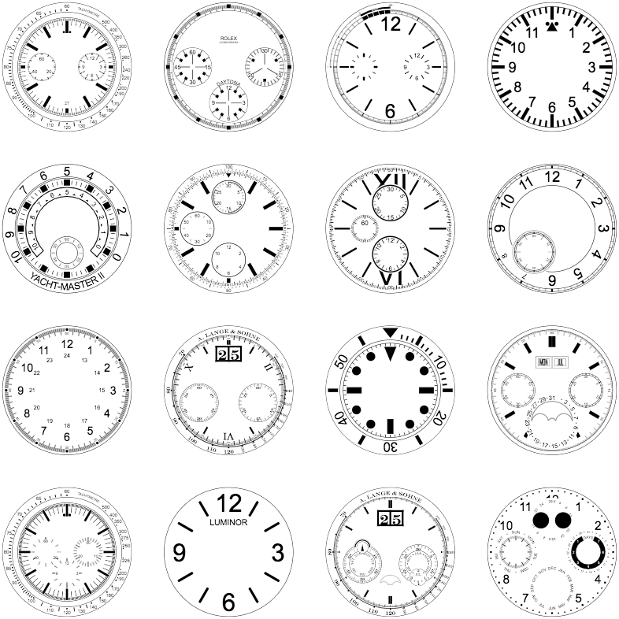
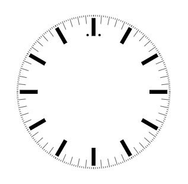
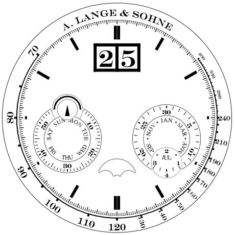

WFDL – Watch Face Description Language
======================================
**Language for defining dials of the watches**




### How to run

```
$ git clone https://github.com/gto76/wfdl.git
$ cd wfdl
$ python3 parse.py
```
* **Open `'index.html'`.**


### Input

```python
[
  {"a_len": 2, "a_width": 0.5, "b_off": 2, "b_len": 23, 
   "c_diameter": 3},
  [
    [1, 
      [12, "line", ["a_len", "a_width * 1.5"]], 
      [60, "line", [11, "a_width"]], 
      [240, "line", ["a_len", "a_width"]]],
    ["a_len + b_off", 
      [12, "line", ["b_len", 5]]],
    ["b_len - c_diameter", 
      [{"1/60", "-1/60"}, "circle", ["c_diameter"]]]
  ]
]
```


### Output




### Explanation

Watch is defined with following Python data structures: List, Dictionary and Set.
On top level is a list that contains two elements. First one is a dictionary of variables, that defines name-value pairs. 

```python
  {"a_len": 2, "a_width": 0.5, "b_off": 2, "b_len": 23, 
   "c_diameter": 3},
```

Second element of the top level list is a list that contains descriptions of face elements.

```python
  [
    [1, 
      [12, "line", ["a_len", "a_width * 1.5"]], 
      [60, "line", [11, "a_width"]], 
      [240, "line", ["a_len", "a_width"]]],
    ["a_len + b_off", 
      [12, "line", ["b_len", 5]]],
    ["b_len - c_diameter", 
      [{"1/60", "-1/60"}, "circle", ["c_diameter"]]]
  ]
``` 

Face elements are grouped by the distance from the watches edge. 0 means "on the edge" and 100 "in the center" of the watch. Our first group contains three elements, all of which are positioned one hundredth of the watches diameter from the edge.

```python
    [1, 
      [12, "line", ["a_len", "a_width * 1.5"]], 
      [60, "line", [11, "a_width"]], 
      [240, "line", ["a_len", "a_width"]]],
```

Each element consists of three fields:
  * First one defines the number of times that it is repeated around the face. 
  * Second one defines the shape of the element.
  * Third one is a list of parameters that are required by the specific shape.

For instance our first element contains 12 lines of length `'a_len'` and width `'a_width * 1.5'`.
```python
      [12, "line", ["a_len", "a_width * 1.5"]], 
```


### Complex Example



```python
[
  {
    "a_len": 3, "a_width": 2, "b_off": 2, "b_len": 7,
    "c_len": 4, "c_width": 0.75, "d_len": 14, "d_width": 3,
    "sub_1_len": 70, "num_len": 13,
    "sub_1": [
        {"_b": 3,
        "subsub_face": [
            [
              [0,
                [1, "border", [1]]
              ],
              [10,
                [4, "number", [27, {"kind": -4, "offset": 0.5}, "lange", "horizontal"]]
              ]
            ]
          ]
        },
        [
          [0,
            [1, "border", [1]],
            [1, "border", [1], "num_len+19"]
          ],
          [0,
            [{0.5}, "face fixed centered", [90, "subsub_face"], 30]
          ],
          [4,
            [6, "line", [7, 3]],
            [30, "line", [10, 1.5]]
          ],
          [11,
            [[6, "-2/6", "2/6"], "number", ["num_len", 30, "lange", "half_rotating"]]
          ],
          ["2*num_len+4",
            [6, "bent_number centered", ["num_len", {"kind": "month", "offset": "1/12"}, "times"]],
            [12, "circle centered", [4]]
          ]
        ]
      ],
    "sub_2": [
        {"_b": 3,
        "subsub_face_1": [
            [
              [0,
                [1, "border", [1.5, 0.7]]
              ],
              [15,
                [1, "border centered", [10, 0.5]]
              ]
            ]
          ],
        "subsub_face_2": [
            [
              [0,
                [1, "border", [2.5]]
              ]
            ]
          ]
        },
        [
          [0,
            [1, "border", [1]]
          ],
          [4,
            [6, "line", [7, 3]],
            [12, "line", [14, 1.5]],
            [60, "line", [7, 1.5]]
          ],
          [11,
            [6, "number", ["num_len", "minute", "lange"]]
          ],
          [0,
            [1, "face fixed centered", [90, "subsub_face_1"]]
          ],
          ["num_len+4",
            [1, "border", [1]]
          ],
          ["num_len",
            [{"pos": 7, "offset": "1/14"}, "bent_number centered",
              ["num_len",  {"kind": "day", "offset": "1/14"}, "times"]]
          ],
          [0,
            [1, "face fixed centered", [60, "subsub_face_2"], "-(2*num_len+4)"]
          ],
          [0,
            [1, "upside_triangle", [33, 14], "-(2*num_len+4+14)"]
          ]
        ]
      ]
  },
  [
    [2,
      [{0.504}, "border", ["a_width/2", 0.709]],
      [{"tachy": [70, 100, 5, 120, 10]}, "line", ["a_len", "a_width"]],
      [{"tachy": [130, 240, 10]}, "line", ["a_len*0.8", "a_width*0.8"]],
      [{"tachy": {280, 330, 400}}, "line", ["a_len*0.6", "a_width*0.6"]],
      [{"tachy": [250, 400, 10]}, "line", ["a_len*0.6", "a_width*0.3"]]
    ],
    ["a_len+b_off",
      [1, "bent_number", [7, ["A. LANGE & SOHNE"], "lange_thin"], 3],
      [{"tachy": [70, 120, 10]}, "number", ["b_len", "tachy", "lange_thin"]],
      [{"tachy": {130, 140, 150, 160, 170, 180, 190, 210, 240}},
          "number", ["b_len*0.7", "tachy", "lange_thin", "perpendicular"]],
      [{"tachy": {280, 330, 400}}, "number", ["b_len*0.5", "tachy", "lange_thin"], 1]
    ],
    [10,
      [1, "border", [0.45]]
    ]
  ],
  [
    [0,
      [1, "border", [0.2]],
      [60, "line", ["c_len", "c_width"]],
      [300, "line", ["c_len*0.66", "c_width*0.66"]]
    ],
    ["c_len+b_off",
      [2, "two_lines", ["d_len", "d_width", 0.1]],
      [12, "line", ["d_len", "d_width"]]
    ],
    [4,
      [1, "lange_date", [29], 14],
      [{0.3135}, "face", ["sub_1_len", "sub_1"]],
      [{0.6865}, "face", ["sub_1_len", "sub_2"]]
    ],
    [18,
      [{0.5}, "moonphase", [20]]
    ]
  ]
]
```
